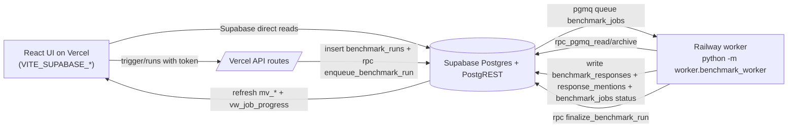

# Stack Guide (Post Queue Migration)

This document is the source-of-truth for how the benchmark system works **now** (after migrating from serial/file-based processing to Supabase queue workers).

Use this as the default context for future AI agents adding features, metrics, models, or data products.

## 1) Current Architecture

## 2) What Changed vs Before

Before:
- Triggered GitHub Actions workflow.
- Ran serial benchmark loop.
- Wrote JSONL/CSV files.
- Ran scripts to aggregate CSV and push to Supabase.

Now:
- Trigger endpoint inserts run + enqueues jobs in `pgmq`.
- Long-lived worker processes jobs in parallel-safe queue semantics.
- Writes responses/mentions directly to DB.
- Aggregations come from SQL materialized views (`mv_*`) + live view (`vw_job_progress`).

## 3) Core Components and Files

### Database (Supabase)
- Queue + job schema: `supabase/sql/007_pgmq_job_queue.sql`
- Materialized/live views + finalize logic: `supabase/sql/008_materialized_views.sql`
- Enqueue function: `supabase/sql/009_enqueue_benchmark_run.sql`

### Worker
- Main worker: `worker/benchmark_worker.py`
- Container: `worker/Dockerfile`
- Local compose: `worker/docker-compose.yml`

### API (Vercel serverless)
- Trigger endpoint: `api/benchmark/trigger.js`
- Runs endpoint: `api/benchmark/runs.js`
- Shared auth/rate limit: `api/_rate-limit.js`

### Frontend / server fallback
- Supabase-first client data layer: `ui/src/api.ts`
- Runs UI and queue progress rendering: `ui/src/pages/Runs.tsx`
- Queue run types: `ui/src/types.ts`
- Express fallback (for no Supabase client config): `ui/server/index.ts`

## 4) Data Model (Runtime)

### Tables
- `prompt_queries`: benchmark prompts/config.
- `benchmark_runs`: one logical run; `model` is stored as CSV string.
- `benchmark_jobs`: one row per `(run_id, query_id, run_iteration, model)`.
- `benchmark_responses`: one row per completed/dead-letter terminal response.
- `response_mentions`: mention booleans per competitor per response.

### Queue RPC Wrappers (must use via PostgREST)
- `rpc_pgmq_send(p_queue, p_message, p_delay)`
- `rpc_pgmq_read(p_queue, p_vt, p_qty)`
- `rpc_pgmq_archive(p_queue, p_msg_id)`

Do **not** call `pgmq.read/send/archive` directly from Supabase clients.

### Views
- `mv_run_summary`
- `mv_model_performance`
- `mv_competitor_mention_rates`
- `mv_visibility_scores`
- `vw_job_progress` (live status)

Finalize and refresh:
- `finalize_benchmark_run(p_run_id)` uses advisory lock (`pg_advisory_xact_lock`) and is idempotent.
- `refresh_benchmark_views()` refreshes all materialized views.

## 5) Request/Job Lifecycle

1. `POST /api/benchmark/trigger` (token required) validates payload.
2. Queue path (when `USE_QUEUE_TRIGGER=true`):
   - Insert `benchmark_runs` row.
   - Call RPC `enqueue_benchmark_run(...)`.
3. `enqueue_benchmark_run` snapshots active `prompt_queries.query_text` into `benchmark_jobs` and sends queue messages.
4. Worker loop:
   - `rpc_pgmq_read`
   - mark job `processing`
   - LLM call + mention detection
   - upsert `benchmark_responses` and `response_mentions`
   - mark `completed` or `dead_letter`
   - `rpc_pgmq_archive`
5. Worker checks `vw_job_progress`; when terminal, calls `finalize_benchmark_run`.
6. Finalize sets `ended_at`, computes score, refreshes `mv_*`.
7. UI reads `mv_*` and `vw_job_progress`.

## 6) Auth, Env Vars, and Hosting

### Vercel API env (required for queue path)
- `BENCHMARK_TRIGGER_TOKEN`
- `USE_QUEUE_TRIGGER=true`
- `SUPABASE_URL`
- `SUPABASE_ANON_KEY` (or `SUPABASE_PUBLISHABLE_KEY`)
- `SUPABASE_SERVICE_ROLE_KEY`
- Optional: `BENCHMARK_ALLOWED_MODELS`, rate limit envs

### Frontend env
- `VITE_SUPABASE_URL`
- `VITE_SUPABASE_ANON_KEY` (or `VITE_SUPABASE_PUBLISHABLE_KEY`)

### Railway worker env
- `SUPABASE_URL`
- `SUPABASE_SERVICE_ROLE_KEY`
- `OPENAI_API_KEY`, `ANTHROPIC_API_KEY`, `GEMINI_API_KEY`
- Optional tuning: `WORKER_QUEUE_NAME`, `WORKER_VT_SECONDS`, `WORKER_POLL_QTY`, `WORKER_EMPTY_SLEEP_SECONDS`, `WORKER_IDLE_EXIT_SECONDS`

## Important platform constraint
`vercel.json` installs deps only with `npm install --prefix ui`. Root `/api` functions should avoid new npm dependencies unless Vercel install strategy is changed.

## 7) Frontend Data Source Rules

Primary production path is **Supabase direct** in `ui/src/api.ts`.

Functions already migrated to view-backed reads:
- `fetchDashboardFromSupabaseViews()`
- `fetchUnderTheHoodFromSupabaseViews()`
- `fetchRunCostsFromSupabaseViews()`
- `fetchTimeseriesFromSupabaseViews()`

Fallback path:
- If Supabase client config is missing, UI hits Express endpoints.
- Express can use CSV source or Supabase source depending on `DASHBOARD_SOURCE`.

## 8) API Contracts (Current)

### `POST /api/benchmark/trigger` (queue mode)
Returns:
- `{ ok, runId, jobsEnqueued, models, promptLimit?, runMonth?, message }`

### `GET /api/benchmark/runs` (queue mode)
Returns:
- `{ ok, runs: BenchmarkQueueRun[] }`
- Each run has `progress` and derived `status` (`pending|running|completed|failed`).

Both endpoints require trigger token (`Authorization: Bearer <token>` or `x-benchmark-token`).

## 9) Legacy/Transitional Paths Still Present

These still exist for rollback compatibility:
- `USE_QUEUE_TRIGGER=false` path in API routes uses GitHub workflow dispatch (`api/_github.js`).
- `.github/workflows/run-benchmark.yml` still exists.
- CSV-era scripts still exist in `scripts/`.

Treat them as compatibility paths unless intentionally removed.

## 10) How To Add New Features Safely

### A) Add new per-response metric
1. Add columns in a new migration (never edit old migrations).
2. Write values in worker at response upsert point (`_upsert_response`).
3. Extend `mv_model_performance` and/or `mv_run_summary` in new migration.
4. Refresh views and update `ui/src/api.ts` mapping types.

### B) Add new run/job progress metric
1. Add column to `benchmark_jobs` or compute in `vw_job_progress`.
2. Update `api/benchmark/runs.js` serialization.
3. Update `BenchmarkQueueRun` type and `Runs.tsx` rendering.

### C) Add new dashboard chart/table data
1. Prefer adding SQL view columns in `mv_*`.
2. Consume them from Supabase path in `ui/src/api.ts`.
3. Keep response shape backward compatible where possible.
4. Only then update Express fallback (`ui/server/index.ts`) if needed.

### D) Add a new LLM provider/model
1. Reuse/extend provider inference in:
   - `enqueue_benchmark_run` (SQL provider assignment)
   - worker provider resolution (`infer_provider_from_model` from `llm_mention_benchmark.py`)
2. Ensure env key and client creation path exist.
3. Add pricing mapping (for run-cost estimates) where relevant.

## 11) Operational Runbook

### Trigger a tiny smoke run
- 1 model, 1 run, low `promptLimit`.

### Watch progress
- `GET /api/benchmark/runs`
- Railway logs for worker job processing.

### Verify completion
- `benchmark_runs.ended_at` is set.
- `overall_score` is populated.
- `vw_job_progress.completion_pct = 100`.

### Common failure modes
- Queue not draining: worker not running or missing env vars.
- Trigger works, no jobs: `USE_QUEUE_TRIGGER` not enabled or enqueue RPC missing.
- Runs endpoint empty: token missing/invalid.
- Frontend stale/slow: materialized views not refreshed (finalization not reached).

## 12) Invariants to Preserve

- Job identity uniqueness: `(run_id, query_id, run_iteration, model)`.
- Queue I/O via RPC wrappers, not raw SQL through Supabase clients.
- Finalization idempotency and lock-based exclusivity.
- Supabase-first UI paths remain authoritative for production.
- Views must stay readable by `anon` and `authenticated` for frontend direct queries.

## 13) Current Status Snapshot

- Queue worker architecture is live and verified end-to-end.
- Railway worker deployment is active.
- Vercel queue trigger/runs path is functional.
- System currently supports clean-slate datasets (prompts/runs can be re-seeded from zero).
