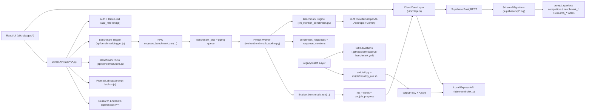

# Agent Stack & Pipeline Map

Purpose: a single map for telling AI agents exactly where to work for UI changes, backend features, database updates, and benchmark pipeline changes.

## 1) Stack Snapshot

- Frontend UI: React 18 + TypeScript + Vite + Tailwind + TanStack Query + Highcharts
  - `ui/src/`, build config in `ui/vite.config.ts`
- Local dev API layer: Express + TypeScript
  - `ui/server/index.ts` (runs on `http://localhost:8787`)
- Hosted API layer: Vercel Serverless (Node/CommonJS)
  - `api/**/*.js`
- Async execution: Python queue worker
  - `worker/benchmark_worker.py`
- Benchmark core logic: Python provider clients, mention detection, scoring artifacts
  - `llm_mention_benchmark.py`
- Data platform: Supabase Postgres + pgmq + materialized views
  - `supabase/sql/*.sql`
- Legacy + batch scripts: local/monthly/CSV/Sheets sync
  - `scripts/*.py`, `scripts/monthly_run.sh`, `.github/workflows/run-benchmark.yml`

## 2) Layer-by-Layer Ownership

### Layer A: UI Routes & Screens

Primary router and page wiring:
- `ui/src/App.tsx`
- `ui/src/components/Layout.tsx`

Main pages:
- Dashboard: `ui/src/pages/Dashboard.tsx`
- Runs + trigger UI: `ui/src/pages/Runs.tsx`
- Prompt management + query lab + cohorts: `ui/src/pages/Prompts.tsx`
- Prompt drilldown: `ui/src/pages/PromptDrilldown.tsx`, `ui/src/pages/PromptDrilldownHub.tsx`
- Competitor analytics: `ui/src/pages/Competitors.tsx`
- Competitor blogs + research actions: `ui/src/pages/CompetitorBlogs.tsx`
- Diagnostics: `ui/src/pages/Logics.tsx` (tests/config routes are redirected here)
- Under the hood metrics/costs: `ui/src/pages/UnderTheHood.tsx`

When change is visual-only, start in page files above.

### Layer B: UI Data Access + Contracts

Single client data gateway:
- `ui/src/api.ts`

Shared frontend types:
- `ui/src/types.ts`

Model pricing and cost rendering helpers:
- `ui/src/utils/modelPricing.ts`

Rule: if a page needs new data fields, update `ui/src/api.ts` and `ui/src/types.ts` together.

### Layer C: HTTP API Surface

Benchmark APIs:
- Trigger benchmark: `api/benchmark/trigger.js`
- Run status list: `api/benchmark/runs.js`
- Shared auth/rate limit: `api/_rate-limit.js`
- GitHub workflow fallback adapter: `api/_github.js`

Prompt Lab API:
- `api/prompt-lab/run.js`

Research APIs:
- Shared utilities + scoring primitives: `api/research/_shared.js`
- Competitor research ingest: `api/research/competitors/run.js`
- Sitemap sync: `api/research/sitemap/sync.js`
- Gap refresh/list/status:
  - `api/research/gaps/refresh.js`
  - `api/research/gaps.js`
  - `api/research/gaps/[id]/status.js`
- Brief generation: `api/research/briefs/generate.js`
- Prompt cohorts/progress:
  - `api/research/prompt-cohorts.js`
  - `api/research/prompt-cohorts/[id]/progress.js`

### Layer D: Worker & Runtime Execution

Queue consumer:
- `worker/benchmark_worker.py`

Container/runtime config:
- `worker/Dockerfile`
- `worker/docker-compose.yml`

Benchmark engine functions used by worker:
- `llm_mention_benchmark.py`
  - provider selection
  - API calls/retries
  - mention detection
  - citations/token extraction
  - comparison/viability CSV generation

### Layer E: Database Schema, Queue, Views

Baseline schema:
- `supabase/sql/001_init_schema.sql`

Security/RLS hardening:
- `supabase/sql/002_allow_anon_config_writes.sql`
- `supabase/sql/003_restrict_public_response_reads.sql`

Feature migrations:
- Prompt tags: `supabase/sql/004_prompt_query_tags.sql`
- Competitor blog table: `supabase/sql/005_competitor_blog_posts.sql`
- Response model metrics columns: `supabase/sql/006_benchmark_response_model_metrics.sql`
- Queue + job table + RPC wrappers: `supabase/sql/007_pgmq_job_queue.sql`
- Materialized views + finalize function: `supabase/sql/008_materialized_views.sql`
- Enqueue function: `supabase/sql/009_enqueue_benchmark_run.sql`
- Overall score correction: `supabase/sql/010_fix_finalize_overall_score.sql`
- Exclude failed responses from visibility math: `supabase/sql/011_exclude_failed_from_visibility.sql`
- Research tables + cohort-aware enqueue updates: `supabase/sql/012_research_features.sql`

Core runtime tables:
- `prompt_queries`, `competitors`, `competitor_aliases`
- `benchmark_runs`, `benchmark_jobs`, `benchmark_responses`, `response_mentions`
- `competitor_blog_posts`, `research_runs`, `brand_content_pages`, `content_gap_items`, `prompt_research_cohorts`, `app_settings`

Core analytics views:
- `mv_run_summary`
- `mv_model_performance`
- `mv_competitor_mention_rates`
- `mv_visibility_scores`
- `vw_job_progress`

### Layer F: Batch/Automation/Legacy Pipelines

Local monthly pipeline:
- `scripts/monthly_run.sh`
- setup docs: `docs/monthly_automation.md`

Dataset assembly + exports:
- Build canonical Looker dataset: `scripts/build_looker_dataset.py`
- Push to Google Sheets WebApp: `scripts/push_to_sheets_webapp.py`
- Push benchmark outputs to Supabase: `scripts/push_to_supabase.py`
- Pull active config from Supabase: `scripts/pull_config_from_supabase.py`
- Push competitor blogs JSON to Supabase: `scripts/push_competitor_blogs_to_supabase.py`

Legacy GitHub Actions path (still supported by feature flag):
- Workflow: `.github/workflows/run-benchmark.yml`
- Triggered when `USE_QUEUE_TRIGGER=false`

## 3) Current Primary Pipeline (Production)

1. UI triggers run from `/runs` page.
2. `POST /api/benchmark/trigger` validates token + payload.
3. API inserts `benchmark_runs` and calls SQL `enqueue_benchmark_run(...)`.
4. SQL function writes `benchmark_jobs` and enqueues pgmq messages via `rpc_pgmq_send`.
5. Worker reads queue via `rpc_pgmq_read`, executes LLM calls, writes:
   - `benchmark_responses`
   - `response_mentions`
   - job status updates in `benchmark_jobs`
6. Worker archives queue messages via `rpc_pgmq_archive`.
7. Worker calls `finalize_benchmark_run` when terminal; finalize refreshes materialized views.
8. UI reads from Supabase views (`mv_*`, `vw_job_progress`) via `ui/src/api.ts`.

Reference guide for this architecture:
- `STACK_AFTER_QUEUE_MIGRATION.md`

## 4) Change Routing Matrix (Where Agents Should Start)

### UI change (layout, copy, charts, interactions)

Start:
- `ui/src/pages/<TargetPage>.tsx`

Also check:
- `ui/src/components/Layout.tsx` for navigation/header
- `ui/src/index.css` for global styles
- `ui/src/types.ts` if new props/data types required

### New frontend data card/table/chart

Start:
- `ui/src/pages/<TargetPage>.tsx`
- `ui/src/api.ts`
- `ui/src/types.ts`

If data does not exist in API/views:
- add/select fields in `supabase/sql` migration and/or `api/*.js`

### Database schema update

Start:
- new migration file in `supabase/sql/` (next numeric prefix)

Then update dependents:
- writer paths (`worker/benchmark_worker.py`, `api/*`, `scripts/push_to_supabase.py`)
- read paths (`ui/src/api.ts`, `ui/server/index.ts` fallback)
- tests in `tests/`

### Benchmark metric change (per response/run/model)

Start:
- write path: `worker/benchmark_worker.py` and/or `llm_mention_benchmark.py`
- schema: new SQL migration in `supabase/sql/`
- aggregates/views: `mv_*` in migration
- frontend mapping: `ui/src/api.ts`, `ui/src/types.ts`, relevant page components

### Queue/orchestration behavior change

Start:
- API trigger/runs: `api/benchmark/trigger.js`, `api/benchmark/runs.js`
- SQL queue function/RPC usage: `supabase/sql/007_*.sql`, `009_*.sql`, `012_*.sql`
- worker loop/terminal logic: `worker/benchmark_worker.py`

### New model/provider support

Start:
- provider inference + client creation: `llm_mention_benchmark.py`
- API allowlists/aliases:
  - `api/benchmark/trigger.js`
  - `api/prompt-lab/run.js`
  - `ui/server/index.ts` (local prompt-lab fallback)
- SQL provider inference in enqueue function migrations
- pricing maps: `ui/src/utils/modelPricing.ts`

### Prompt/competitor config behavior

Start:
- UI flows: `ui/src/pages/Prompts.tsx`
- client API methods: `ui/src/api.ts`
- DB tables: `prompt_queries`, `competitors`, `competitor_aliases`
- local file fallback path: `config/benchmark_config.json`, `ui/server/index.ts`

### Research feature changes (gaps/briefs/sitemap/blogs/cohorts)

Start:
- endpoint logic: `api/research/**/*.js`
- shared scoring/utilities: `api/research/_shared.js`
- schema/tables: `supabase/sql/012_research_features.sql` + new migrations
- UI surface: `ui/src/pages/CompetitorBlogs.tsx`, `ui/src/pages/Prompts.tsx`, `ui/src/types.ts`, `ui/src/api.ts`

### Auth/rate-limit hardening

Start:
- `api/_rate-limit.js`
- all protected endpoints in `api/benchmark/*` and `api/research/*`
- local server wrappers in `ui/server/index.ts` (`requireWriteAccess`, handler wrappers)

## 5) Local Dev Runtime Map

Frontend + local API:
- `cd ui && npm run dev`
- UI: `http://localhost:5173`
- API: `http://localhost:8787`

Vite proxy:
- `ui/vite.config.ts` proxies `/api` -> local Express

Supabase-first behavior:
- if `VITE_SUPABASE_URL` + anon key are set, `ui/src/api.ts` reads/writes Supabase directly first
- if missing/failing, it falls back to local `/api`

## 6) Deployment & Environment Boundaries

Vercel project behavior:
- `vercel.json` builds only `ui/` (`npm install --prefix ui`, `npm run build --prefix ui`)
- root `api/` serverless functions still run, but avoid adding new root npm deps unless install strategy changes

Worker hosting:
- railway/container expected for `python -m worker.benchmark_worker`

Critical env groups:
- Trigger auth: `BENCHMARK_TRIGGER_TOKEN`
- Queue mode switch: `USE_QUEUE_TRIGGER=true`
- Supabase: `SUPABASE_URL`, `SUPABASE_ANON_KEY`/`SUPABASE_PUBLISHABLE_KEY`, `SUPABASE_SERVICE_ROLE_KEY`
- LLM keys: `OPENAI_API_KEY`, `ANTHROPIC_API_KEY`, `GEMINI_API_KEY`

## 7) Test Map (Where to Add Tests)

Python benchmark/dataset logic:
- `tests/test_llm_mention_benchmark.py`
- `tests/test_build_looker_dataset.py`

Node API/research behavior:
- `tests/test_research_algorithms.mjs`
- `tests/test_research_api_endpoints.mjs`

When changing:
- mention/scoring math -> add Python tests
- API payload/contracts/validation -> add Node tests
- SQL view logic -> add regression fixture checks in API tests and/or downstream mapping tests

## 8) Quick Agent Prompts (Copy/Paste)

Use this when assigning work to an AI agent:

- UI only:
  - "Implement this in `ui/src/pages/<page>.tsx`. Keep `ui/src/api.ts` and `ui/src/types.ts` unchanged unless new data fields are needed."

- UI + data field:
  - "Add new field end-to-end: SQL migration in `supabase/sql/`, map in `ui/src/api.ts`, type in `ui/src/types.ts`, render in `ui/src/pages/<page>.tsx`."

- DB migration:
  - "Create a new numbered migration in `supabase/sql/` (do not edit old migrations), then patch all writers/readers affected (worker/API/UI mapping)."

- Queue pipeline change:
  - "Update `api/benchmark/trigger.js`, SQL enqueue function, and `worker/benchmark_worker.py` consistently. Preserve idempotent finalization and queue RPC wrappers."

- Research feature:
  - "Implement in `api/research/**/*.js` and `api/research/_shared.js`; if schema changes are needed add a new `supabase/sql` migration and wire UI through `ui/src/api.ts` + relevant page."

## 9) Node Charts

### A) System Node Graph

### B) Change Routing Decision Graph

```mermaid
flowchart TD
  Q["What are you changing?"] --> UIQ["UI only"]
  Q --> DATAQ["UI + new data field"]
  Q --> DBQ["Database schema/view"]
  Q --> PIPEQ["Queue/pipeline runtime"]
  Q --> MODELQ["New model/provider"]
  Q --> RESQ["Research feature"]

  UIQ --> U1["Start: ui/src/pages/[page].tsx"]
  UIQ --> U2["Maybe: ui/src/components/Layout.tsx"]

  DATAQ --> D1["Start: ui/src/api.ts + ui/src/types.ts + target page"]
  DATAQ --> D2["If missing in backend: add SQL migration and/or api/*.js update"]

  DBQ --> B1["Start: new supabase/sql/[next]_*.sql"]
  DBQ --> B2["Then: worker/API writers + ui/src/api.ts readers + tests"]

  PIPEQ --> P1["Start: api/benchmark/trigger.js + api/benchmark/runs.js"]
  PIPEQ --> P2["Then: queue SQL (007/009/012) + worker/benchmark_worker.py"]

  MODELQ --> M1["Start: llm_mention_benchmark.py (provider inference + clients)"]
  MODELQ --> M2["Then: api/benchmark/trigger.js + api/prompt-lab/run.js + ui/server/index.ts + model pricing map"]

  RESQ --> R1["Start: api/research/**/*.js + api/research/_shared.js"]
  RESQ --> R2["Then: supabase/sql migration + ui/src/api.ts + Prompts/CompetitorBlogs pages"]
```

